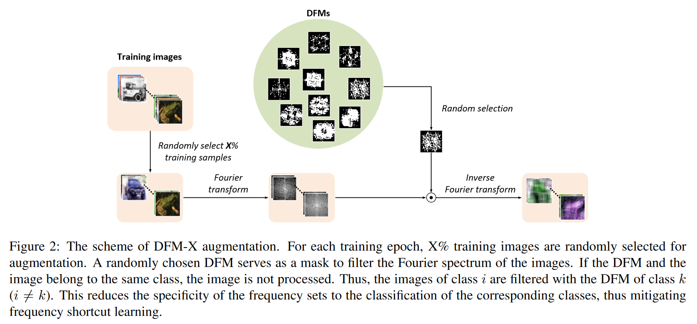

# Official website of '[DFM-X: Augmentation by Leveraging Prior Knowledge of Shortcut Learning](https://openreview.net/forum?id=NywSmrJ3Hr) (ICCV2023 Worshop VIPrios)' 
-Augmentation for CV using frequency shortcuts
---

##Introduction
Neural networks are prone to learn easy solutions from superficial statistics in the data, namely shortcut learning, which impairs generalization and robustness of models. We
propose a data augmentation strategy, named DFM-X, that leverages knowledge about frequency shortcuts, encoded in Dominant Frequencies Maps computed for image classification models. We randomly select X% training images of certain classes for augmentation, and process them by retaining the frequencies included in the DFMs of other classes. This strategy compels the models to leverage a broader range of frequencies for classification, rather than relying on specific frequency sets. Thus, the models learn more deep and task-related semantics compared to their counterpart trained with standard setups. Unlike other commonly used augmentation techniques which focus on increasing the visual variations of training data, our method targets exploiting the original data efficiently, by distilling prior knowledge about destructive learning behavior of models from data. Our experimental results demonstrate that DFM-X improves robustness against common corruptions and adversarial attacks. It can be seamlessly integrated with other augmentation techniques to further enhance the robustness of models.

